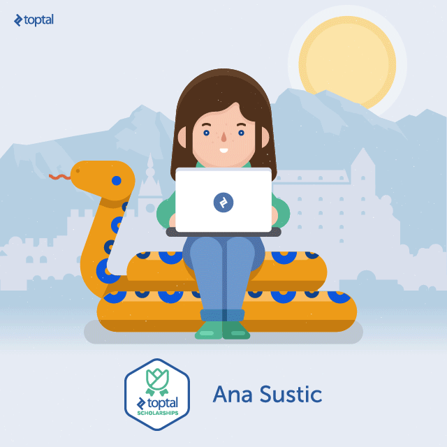

I am the second winner <i class="fa fa-star"></i><i class="fa fa-star"></i> of the <a href="http://www.toptal.com/press-center/second-scholarship-winner">Toptal Scholarchip for Female Developers</a> and I am so happy and excited about it.
 

It was a priviledge talking to <a href="https://twitter.com//annachiara_b">Anna Chiara Bellini</a>, Director of Engineering at Toptal and <a href="https://twitter.com/DrorLiebenthalDror">Dror Liebenthal</a> during the selection process. Dror wrote the announcement on <a href="http://www.toptal.com/press-center/second-scholarship-winner">Toptal</a>. Thank you both! 

In addition to the US$5,000.00 I will be getting <b>one year of software programming-related mentorship by a Toptal designated mentor</b>. I find the mentorship part of the Scholarship a very valuable experience and I'm looking forward to that. As far as I know the Slovenian Tax will take a portion of my $$$ award but I cannot do much about it.</a>

Here is a picture of me programming by Toptal designers <i class="fa fa-smile-o"></i>

The first scholarship winner was <a href="http://www.toptal.com/press-center/first-scholarship-winner"> Rojina Bajracharya</a>, an amazing Python developer</a>, entrepreneur, and mentor from Bhaktapur, Nepal.

I am looking forward to this year's programming experience that was made possible by <a href="http://www.toptal.com/scholarships">Toptal</a>!

